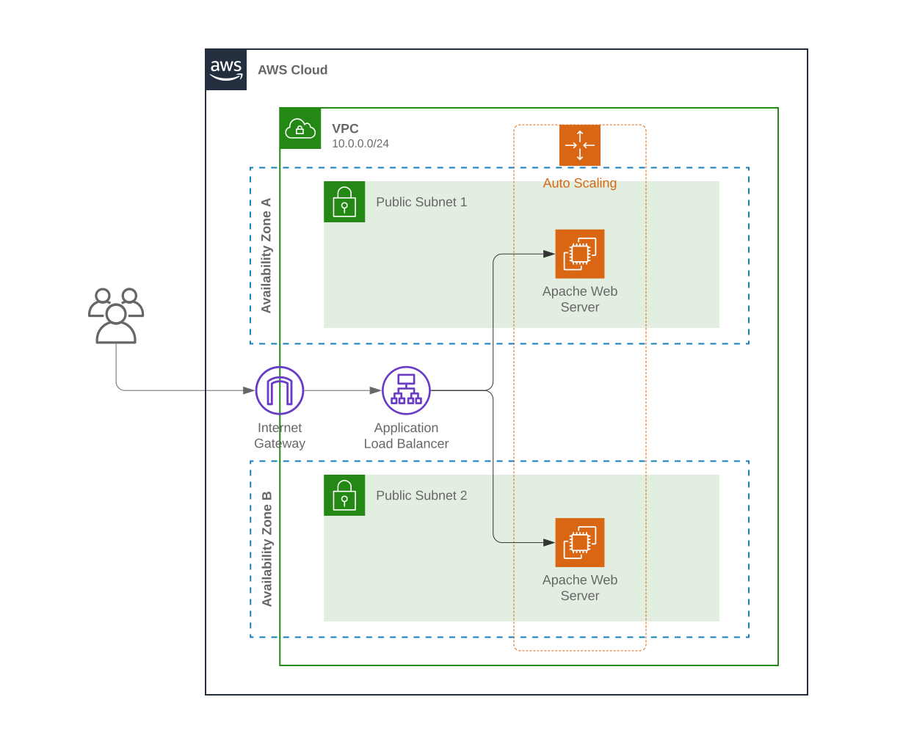

# ansible-aws-cfn

> Playground project to experiment with Ansible, AWS CloudFormation and Travis CI

## About

  

This project contains all the code necessary to provision the infrastructure and configure a simple web application on AWS. I recently started exploring the magical world of CI/CD, IaC and configuration management and my goal here is to automatically manage the infrastructure and configuration of an application from source code, minimizing manual intervention as much as possible.

### Built With

-   [Ansible](https://www.ansible.com)
-   [AWS CloudFormation](https://aws.amazon.com/cloudformation)
-   [Travis CI](https://travis-ci.org)
